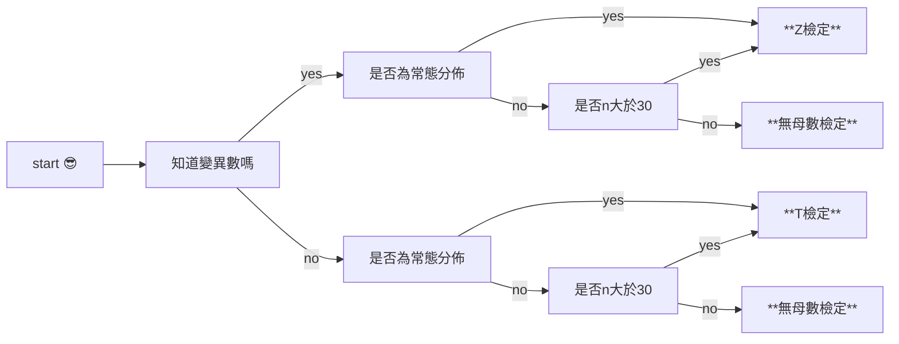
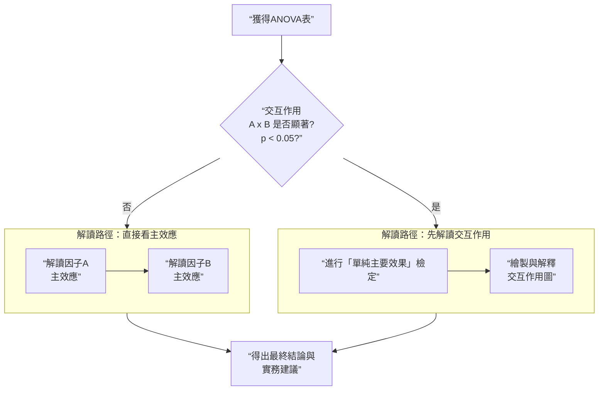

# 統計note
 ## CH2 
 ### binomial distribution 二項分布
 #### 定義跟公式
*  只有**success** 跟 **failure**
* 其中，變異數跟平均數符合:👉
$$\mu=np,\, \sigma^2=npq$$
* 查二項分布表時，n=投幾次銅板，t=出現了幾次正面
* 記得分布表示從左尾開始累積的 🙃
* if $p$ 小於0.5 → 右偏斜，反之
#### R怎麼算?
* 舉以下栗子🌰:
```r
##### 假如16個病人，康復的機率不到0.1 #####
## 少於五人康復的機率
pbinom(5, 16, p = 1/10) # CDF: P(X <= 5) = F(5)

## 至少五人康復的機率
1 - pbinom(4, 16, p = 1/10) # P (X >= 5) = 1 - F(4)

## 剛好五人康復的機率
dbinom(5, 16, p = 1/10) # pdf: P(X = 5) = f(5)
```
* 要記得:
> p開頭=累積，也就是CDF
d開頭=無累積，也就是PDF
---
### Poisson distribution 柏松分布
#### 定義跟公式
* 適用於**機率p極小，樣本數n很大，沒法做二項分配**時
* 稀有事件 (例如你家門前發生車禍的機率 👀)
* 平均數=變異數，也就是$\mu=\sigma^2$
* if $n\rightarrow\infty, p\rightarrow 0, np=\mu$，二項分布類似柏松分布 (因為這時$q$接近1，又$\sigma = npq$，所以變異數跟$\mu$類似)
* 查表時，$\mu$代表平均發生的車禍次數，$x$代表實際發生的次數

#### R怎麼算?
* 只有$\mu$(在後)跟$x$(在前)兩個數值
* 舉以下栗子🌰:
```r
##### 抓魚，平均每次抓到兩隻 #####
## (a) 這次沒抓到魚的機率
dpois(0, 2) # pdf: P(X= 0) = f(0)

## (b) 抓到小於六隻的機率; P(X < 6) = F(5)
ppois(5, 2) # CDF: F(5)

## (c) 抓到3~6隻的機率; P(3 < X < 6) = F(5) − F(3)
ppois(5, 2) - ppois(3, 2)
```
---
### normal distribution 常態分佈
#### 定義跟公式
* 圖形下面積=機率值，特定值沒有機率 (取現下面積為0)
* $\mu$ 是分布圖形的山頂🏔️，$\sigma^2$決定山的高矮胖瘦
* 標準常態分佈 (Z分布)，把樣本的數值減去平均數後在除以標準差的過程叫做**標準化**，作法大家都有在高中做過吧...
$$z=\frac{x-\mu}{\sigma}$$
* Z表的查法:縱向為Z值到小數點後第一位，橫向為小數點，都是從右尾累積分布
#### R怎麼算?
* 舉以下栗子🌰:
```r
##### 設一個智商常態分佈，平均數=100，標準差=10 #####
## (a) 智商小於90的機率是多少
pnorm(90, mean = 100, sd = 10) 
# CDF; P(X < 90) = F(90)

## (b)智商在90到115的機率是多少
pnorm(115, mean = 100, sd = 10) - pnorm(90, mean = 100, sd = 10) 
# P(90 < X < 115)

## (c) 智商高於125的機率是多少
pnorm(125, mean = 100, sd = 10, lower.tail = FALSE)

## (d)  find x so that P(X ≤ x) = 0.95
qnorm(0.95, mean = 100, sd = 16)
```
* 在此處，lower.tail=FALSE代表要算右尾，因為R一般來說都默認左尾(畢竟都是從左尾累積...) 🙃
---
## CH3
### sampling distribution 取樣分布 & central limit theorem 中央極限定理
#### 取樣分布是什麼?
* 例如你每次隨機抽樣本，樣本數固定下，你的平均不一定一樣
* 這些不同平均數的分布跟差異，就是取樣分布，that is 👉
> 我每一次抽的樣本平均都不一樣，抽樣無限多次，都會得到不同的樣本平均，我做出**所有可能的樣本平均的機率分布**，就是取樣分布
#### 中央極限定理呢?
* 當取樣夠大，例如$n>30$，或是母體像常態分佈，**取樣分布會趨近常態分佈**
* 而且這時取樣分布平均就是$\mu$，取樣分布標準差為標準誤(也就是$\frac{\sigma}{\sqrt[]{n}}$，簡稱**SE**)
#### 信賴區間 confidence interval, CI
* 透過我們對Z分布的了解，如果我們有辦法知道完整的取樣分布(要是你有這個時間 😅)， 你可以從這個取樣分布，找出**抽出了某個樣本的平均值的CI**。由於:
$$Z=\frac{\bar{X}-\mu}{\sigma / \sqrt[]{n}}$$
* 我們可以透過Z值反推，預期特定比例的$\bar{X}$，會落在一個數值範圍內。例如95%的$\bar{X}$會落在:
$$\mu \pm 1.96 SE$$
#### 信賴區間、顯著水準、Z值對應 (超重要給我記住)

| CI | α | critical value, Z |
| - | - | - |
| 90%     | 0.1     | 1.645    |
| 95%    | 0.05     | 1.96   |
| 99%    | 0.01     | 2.576     |

---
> 在這裡，讓我們來想一個問題...
請問你只有一個樣本是要做甚麼統計?
讓我們來思想實驗下 🧘‍♀️:

* 假如說我是 X̄（我是變動的，會跳來跳去），然後你是μ，你永遠固定不動。
* μ有一頂大帽子，叫做Z分布，所以μ可以看到X̄在身邊跳來跳去，去分析X̄出現在你帽子底下的機率。
* 最後μ算出了，在正負1.96 SE的區域，X̄出現的機率是95%。也就是:
$$CI_\bar{X} =\mu \pm 1.96 SE$$
* 那現在，換X̄戴上這個一樣大的Z分佈帽子。
* 想想看，**X̄現在戴上帽子不斷跳來跳去，看著μ，在X̄的眼裡，看起來是不是μ反倒變成了跳來跳去的那一個**?因此:
$$CI_\mu=\bar{X} \pm 1.96 SE$$
* 因此，想知道$\mu$的信賴區間，就是這樣算。
---
### student t distribution
#### 定義:
* 我們已經知道了算$CI_\mu=\bar{X}$的方法，但是平常$\sigma$是未知的，所以我們要換成t分布。
* 做法:**以t值取代Z值，以$s$取代$\sigma$，其餘不變**。也就是:
$$t_{(df=n-1)}=\frac{x-\mu}{s/\sqrt[]{n}}$$
* t分布會隨自由度$df=n-1$改變。查t值看橫向α值以及縱向自由度。
---
### 卡方分布
#### 定義
* 是推估母體標準差信賴區間的方法。卡方值$X^2$為:
$$\chi^2=\frac{(n-1)s^2}{\sigma^2}$$
* 所以信賴區間CI就是:
$$\frac{(n-1)s^2}{\chi^2_{(v,\alpha/2)}} \le \sigma^2 \le \frac{(n-1)s^2}{X^2_{(v,1- \alpha/2)}}$$
* 查表的時候要查兩個值，如果是95%的信賴區間，橫向查0.975跟0.025，縱向為自由度$df=n-1$
* chi-square分布的期望值 (平均)，就是 "$S^2=\sigma^2$"，**所以期望值就是自由度**。

> ***by the way***
> 根據數學，標準常態分佈被平方之後，其變異數 $\sigma^2$ 會從1變成2。
> 同時，$\chi^2(k)$ 又表示成: 
> $$\chi^2=Z_1^2 + Z^2_2 + \ldots + Z_k^2$$
> 也就是 "k個常態分佈平方和聚在一起" 
> 因此，如果把chi-square分布找出其變異數，同時每個常態分佈的變異數剛好是2，總變異數就是2k
> **卡方分布的變異數就是 "兩倍自由度"** !!

---

### 母體比例區間估計
#### 定義
* 你常在新聞上看到的 "XX民調支持度為45%，抽樣誤差為3%" 就是這種東西 😗
* 此處的民調支持度叫做樣本比例$\hat{p}$。算出來的信賴區間CI為:
$$CI=(\hat{p}-z_{(1-\alpha/2)}\sqrt[]{\frac{\hat{p}(1-\hat{p})}{n}},\hat{p}+z_{(1-\alpha/2)}\sqrt[]{\frac{\hat{p}(1-\hat{p})}{n}} )$$
##### 最少樣本數做法:
$$n=\frac{z^2 \times \hat{p}\times (1-\hat{p})}{E^2}$$
* 其中，E為誤差範圍。如0.03(在正負3%之間)
---
### R怎麼算?
* R裡面沒有自帶Z-test這種東西，但是你可以請電腦幫你用手算。
```r
# 假設有以下樣本：
x <- c(49.1, 50.2, 48.8, 51.0, 50.3)
mu0 <- 50
sigma <- 1  # 已知母體標準差

n <- length(x)
xbar <- mean(x)
z <- (xbar - mu0) / (sigma / sqrt(n))  # Z 統計量
print(z)

# 雙尾檢定 p 值
p <- 2 * (1 - pnorm(abs(z)))
print(p)
```
* R裡面本身就有t-test，可以直接弄。
```r
x <- c(49.1, 50.2, 48.8, 51.0, 50.3)
mu0 <- 50

t.test(x, mu = mu0, alternative = "two.sided")
```
* 你可以自動選擇要左尾、右尾還是雙尾。也就是:
```r
alternative="greater" #對立假說是平均應該比較大
alternative="less"    #對立假說是平均應該比較小
```
* 卡方檢定也可以算喔 👀
```r
x <- c(49.1, 50.2, 48.8, 51.0, 50.3)
sigma0_sq <- 1  # 母體變異數 H0
n <- length(x)
s_sq <- var(x)

chi2 <- (n - 1) * s_sq / sigma0_sq  # 卡方統計量
print(chi2)

# 雙尾檢定 p 值
p <- 2 * min(pchisq(chi2, df = n - 1), 1 - pchisq(chi2, df = n - 1))
print(p)
```
---
### 總結整理

| Parameter                         | Requirements                                                                 | Distribution & Test Statistic                                  |
|-----------------------------------|------------------------------------------------------------------------------|---------------------------------------------------------------|
| **Proportion**                    | $np \geq 5$ 且 $nq \geq 5$                                                  | Normal: $z = \frac{\hat{p} - p}{\sqrt{ \frac{pq}{n} }}$       |
| **Mean**                          | $\sigma$ 已知，母體常態分布<br>或 $\sigma$ 已知，$n > 30$                 | Normal: $z = \frac{\bar{x} - \mu_x}{\sigma / \sqrt{n}}$        |
|                                   | $\sigma$ 未知，母體常態<br>或 $\sigma$ 未知，$n > 30$                      | Student t: $t = \frac{\bar{x} - \mu_x}{s / \sqrt{n}}$          |
|                                   | 母體非常態，$n \leq 30$                                                     | 非參數法（例如 Wilcoxon）、或 Bootstrapping                  |
| **Standard Deviation or Variance** | 嚴格要求母體常態                                                             | Chi-square: $\chi^2 = \frac{(n - 1)s^2}{\sigma^2}$            |

---
## CH4
### 虛無假說跟對立假說
* 虛無假說視我們想要推翻的，稱為null hypothesis，$H_0$
* 另訂一對立假說，即我們希望正確的可能，alternative hypothesis，$H_1$
* 臨界點區分接受區跟拒絕區，以$\alpha$值來當作參考。所以:
$$p>\alpha\rightarrow accept\, H_0$$
  以及:
$$p<\alpha\rightarrow reject\, H_0$$
### 兩種錯誤跟檢定力 power
#### 第一型錯誤
* type I error, $\alpha$
* $H_0$為真，卻拒絕$H_0$
#### 第二型錯誤
* type II error, $\beta$
* $H_0$為假，卻無法拒絕$H_0$


### 檢定力 power 的增加方法
* **檢定力power = 正確地拒絕虛無假說的機率**。
* power=$1-\beta$
* 增加$\alpha$，可以讓檢定力增加(但是type I錯誤機率變大)
* 如果$\mu_1$-$\mu_0$的差距變大 (也就是弄個誇張的$H_0$)，可以讓檢定力增加
* 增加樣本數，可以讓取樣分布變扁，讓檢定力增加 (SE縮小)

> **唯一讓你檢定力增加的方法，就是增加實驗樣本數**!!!😎


### 檢定步驟
* 建立$H_0$跟$H_a$，決定顯著水準$\alpha$
* 蒐集並計算樣本統計量
* 比較估計值跟檢定值(差距是否大到超過偶然)
* 做出決策----reject or accept $H_0$
* 可以透過判斷信賴區間 ($CI\rightarrow \bar{X}\pm \text{critical value}\times SE$)，或是直接算觀察值在假設下，對應的z值、t值或是chi-square值
##### 檢定時的注意事項
* 邊界(reject $H_0$)區，是對立假說成立的地方
* 記得**等號一定歸類給虛無假說**

### 舉栗 🌰
##### Z分布題目
> 以下為前提:
> n=49, $\sigma$=12.1, $\bar{X}$=27.3，$H_0\rightarrow \mu=30.0$，$H_a\rightarrow \mu \ne 30.0$, $\alpha = 0.01$

* 此為一雙尾檢定
* 如果要算critical值，$\bar{X}$算出的z值為:
$$Z_{\bar{X}}=\frac{\bar{X}-\mu_H}{\frac{\sigma}{\sqrt[]{n}}}=\frac{27.3-30.0}{\frac{12.1}{\sqrt[]{49}}}=-1.575$$
* 記得，critical值是以$\mu_H$為假設分布的中心，而$\bar{X}$落在該假設分布的左側
* 由於雙尾的$Z_{\alpha=0.01}=\pm 2.576$，落在範圍內，所以接受$H_0$
* R的算法:
```r
##Z分布
n <- 49
sigma <- 12.1
X_bar <- 27.3
mu_H <- 30
alpha_z <- 0.01
SE_z <- sigma/sqrt(n)

##查Z臨界值的方法--用qnorm()
##雙尾要除以2
z_critical <- qnorm(1-alpha_z/2)
z_value <- (X_bar - mu_H)/ SE_z

if(abs(z_value) > z_critical){
  result_z <- "reject H0 ●'◡'●"
} else {
    result_z <- "accept H0 >_< "
}

##輸出檢定結果
print(result_z)
```
---


* 信賴區間查表0.005%後，是在$z=\pm 2.576$，再計算:
$$CI=(27.3-2.575\times \frac{12.1}{\sqrt[]{49}}, \, 27.3+2.576\times \frac{12.1}{\sqrt[]{49}})=(22.85,\, 31.75)$$
* 由於30在CI的範圍內，所以接受$H_0$


---

##### t分布題目
> 以下為前提:
> n=49, $\bar{X}$=27.3，s=12.1，$H_0\rightarrow \mu\ge 30.0$，$H_a\rightarrow \mu<30.0$,$\alpha = 0.05$
* 此為一左尾檢定。如果要算critical值，落入的t值為下
$$t_{\bar{X}}=\frac{\bar{X}-\mu_H}{\frac{s}{\sqrt[]{n}}}=\frac{27.3-30.0}{\frac{12.1}{\sqrt[]{49}}}=-1.575$$
* t在左尾的臨界值為$t_{(48,0.05)}=-1.6772$，沒有落於拒絕區，接受$H_0$
* R的算法:
```r
##t分布
n <- 49
s <- 12.1
X_bar <- 27.3
mu_H <- 30
alpha_t <- 0.05
SE_t <- s/sqrt(n)

##查t臨界值的方法--用qt()，此臨界值為小數
##左單尾不用除以2
t_critical <- qt(alpha_t, df = n - 1)
t_value <- (X_bar - mu_H)/ SE_t

if(t_value < t_critical){
  result_t <- "reject H0 ●'◡'●"
} else {
    result_t <- "accept H0 >_< "
}

##輸出結果
print(result_t)
```

---

* 改用信賴區間確認，由於$t_{(48,0.05)}$=1.6772，算CI時如下:
$$CI=(-\infty, 27.3+1.6772\times\frac{12.1}{\sqrt[]{49}})=(-\infty, 30.199)$$
* 由於30在置信區間裡面，所以無法拒絕$H_0$
---
> **btw，這裡有一個非常重要的點要記得... 🧘‍♀️**
> - 信賴區間要說的是: **假如說我的分布的中心是$\mu$，然後該分布的尾巴跟檢定相同，那在我還能接受$H_0$的情況之下，甚麼樣的$\mu$，可以讓$\bar{X}$還能接受$H_0$?**
> - 所以信賴區間，是在說 "伱的虛無假說跟對立假說要設什麼樣的的數字，才能夠**接受虛無假說**" 的範圍。
> - 所以為何是沒有下界?因為他是左尾，所以就算$\mu$很低 (例如假設 $\mu$= -1000)，$\bar{X}$=27.3這個情況依然是支持$H_0$ !!
> - (當然，誰會在定假設時，在看到$\bar{X}$=27.3，還定$\mu$= -1000 這種東西... 🤣)

---

##### chi-square題目
> n=30, $\bar{X}$=27.3，s=12.1，$H_0\rightarrow \sigma=18.0$，$H_a\rightarrow \sigma\ne 18.0$，$\alpha=0.01$
* 此為一雙尾檢定
* 如果要算critical值，卡方值直接算:
$$\chi^2_{\bar{X}}=\frac{s^2(n-1)}{\sigma^2_H}=\frac{12.1^2(30-1)}{18^2}=13.104$$
* 該查兩個數值:$X^2_{(0.995)}=13.121$ 跟 $X^2_{(0.005)}=52.336$，13.104落在這區間內，因此拒絕$H_0$
* R的算法:
```r
##chi-square分布
n <- 30
s <- 12.1
X_bar <- 27.3
mu_H <- 30
alpha <- 0.01
sigma_H <- 18
df_chi <- n-1

## 信賴區間:算出兩個chi-square值
chi_low <- qchisq(1 - alpha/2, df_chi)
chi_high <- qchisq(alpha/2, df_chi)
chi_value <- (s^2 * df_chi)/sigma_H^2

##這裡的"||"指的是 "而且"
if(chi_value < chi_low || chi_value > chi_high){
  result_chi <- "reject H0 ●'◡'●"
} else {
    result_chi <- "accept H0 >_< "
}

print(result_chi)
```

---
* 如果要改用算$\sigma^2$的信賴區間，以下:
$$CI=(\frac{s^2(n-1)}{X^2_{(0.005)}}, \frac{s^2(n-1)}{X^2_{(0.995)}})=(\frac{12.1^2(30-1)}{52.336}, \frac{12.1^2(30-1)}{13.121})=(81.13,\, 323.59)$$
* 由於18*18=324沒有在置信區間裡面，因此捨棄虛無假說

---

##### 果蠅題目

> 720個正常翅(VV)，280殘翅(vv)，假設殘翅比例為p，假說檢定中:$H_0\rightarrow p=0.25$，$H_a\rightarrow p \ne 0.25$，$\alpha=0.1$

* 首先，$\hat{p}=\frac{280}{(720+280)}=0.28$，我們把其當作常態分布。

* 標準誤為$\sqrt[]{pq/n}$，所以:
$$SE=\sqrt[]{\frac{0.28\times 0.72}{1000}}=0.0142$$
* 查$\alpha=0.1$時的Z表，得 $z= \pm 1.645$，因此:
$$CI=(0.25-1.645\times 0.0142,0.25+1.645\times 0.0142)$$
* 算出來的答案是:
$$CI=(0.257, 0.303)$$
* 由於0.25在置信區間之外，因此拒絕$H_0$
* R怎麼算? 
```r
## 一句搞定，相繼放入vv、總數、假設p、信賴區間 ƪ(˘⌣˘)ʃ
binom.test(280, 1000, p=0.25, conf.level = 0.9)
```


---

##### 分數問題
> 成績的$\sigma=20$,取樣36個學生平均分數為65，求:
> 1. $\mu$的95%信賴區間
> 2. if 認為全班平均為70，在$\alpha$=0.05，是否拒絕$H_0$
> 3. if 取樣人數變成25，平均分數65，結果會不會變?


* 第一題為:
$$CI=(65-1.96\times \frac{20}{\sqrt[]{36}},65+1.96\times \frac{20}{\sqrt[]{36}})$$
* 答案為:
$$CI=(58.46, 71.53)$$
* 第二題的假說設置為:
$$H_0\rightarrow \mu=70,\, H_a\rightarrow \mu\ne70$$
* 因此，70位於置信區間內，接受$H_0$
* 第三題，如果改變n，那置信區間會變成:
$$CI=(65-1.96\times \frac{20}{\sqrt[]{25}},65+1.96\times \frac{20}{\sqrt[]{25}})=(57.16, 72.84)$$
* 因此，70位於置信區間內，接受$H_0$

---
## CH5
### 有母數跟無母數
##### 有母數統計
* 假設**母體為常態分布**
* 可推出平均值或是變異數
##### 無母數統計
* 母體**非常態、或是小樣本統計**
* 做不出某些參數，**可能只能推論出中位數，不能推出平均數**
* 以等級跟符號為主要統計量
##### 怎麼分析流程圖

### QQ plot and Shapiro-Wilk test
* 把數據以及相對應分位數的理論常態分布值，畫成散步圖
* 如果**呈現一條45°的線，就是常態分布**
* 但這是視覺判定，只能當作**輔助功能**
* x軸為數值轉換成Z值的樣子，y軸為樣本值


* Shapiro-Wilk test是更常用的常態檢定，算出來的p-value如果大於0.05，我們就說該資料**符合常態分佈**
* R的做法:
```r
qqnorm(sample) #畫出sample的常態QQ圖
qqline(sample) #在QQ圖上，加上一條Q1 to Q3的直線

##一行搞定檢定 ●'◡'●
shapiro.test(sample)
```
### 無母數統計優缺點
* 母體**非常態分布、未知、樣本不夠大**可用
* 如果非常態分佈，無母數統計的檢定力較高
* 但**不可查表，只使用排序跟符號**，浪費集中趨勢、分散性等資料

### sigh test
* 設置假說時:
$$
\begin{array}{l}
H_0\rightarrow \text{母體中位數}m_e=\text{假設的中位數}c\\
H_a\rightarrow \text{母體中位數}m_e\ne\text{假設的中位數}c\\
\end{array}
$$
* 利用二項分布，蒐集+跟-，然後選擇$min(S^+,S^-)$，並且算出現的機率值，看看有沒有小於$\alpha$
##### 栗子時間 🌰
> 10個員工的數據如下，請問薪資中位數是否是2.2萬?

* 各職員薪資，並且跟2.2萬比較後得到符號如下:

|1|2|3|4|5|6|7|8|9|10|
|--|--|--|--|--|--|--|--|--|--|
|1.8|2.1|2.3|2.5|3.2|5.4|2.1|5.2|6.7|8.8|
|-|-|+|+|+|+|-|+|+|+|

* 我們查出min值，並且查二項分配表。如果是雙尾，算出的p值要乘以2:
$$
\begin{array}{l}
min(+,\,-)=3\\
H_0\rightarrow\text{員工薪資中位數}=22000\\
H_a\rightarrow\text{員工薪資中位數}\ne 22000\\
n=10,\, \alpha=0.05\rightarrow p=0.1719\\
\because 0.1719\times2=0.3438>0.05\\
\therefore accept\, H_0
\end{array}
$$
---
* 如果遇到大樣本狀況，例如n>20，沒辦法做二項分配，就要視之為常態分佈的方式計算
* 公式為:
$$
\begin{align}{l}
& p=q=0.5\\
& \mu=np,\,\sigma^2=npq\\[1em]
& \therefore z=\frac{(d+0.5)-\mu}{\sigma}=\frac{(d+0.5)-\frac{n}{2}}{\frac{\sqrt[]{n}}{2}}
\end{align}
$$
* 其中，$(d+0.5)$是**連續型校正**，由於其算的是屬於$min(S^+,S^-)$，所以勢必是屬於左邊累積的結果，那就是+0.5
##### 栗子時間 🌰
> 大部分人覺得六月的正常溫度應該是75℉，我們現在有六月30天的數據，請問是否這次六月特別熱? 🤔
```r
##氣溫(華氏)
temperature <- c(72, 78, 79, 75, 74, 70, 77, 83, 85, 85, 84, 85, 80, 78, 82, 83, 
                 83, 77, 68, 69, 76, 76, 80, 72, 73, 70, 70, 78, 78, 78)
```
* 兩個假說分別為:
* 這裡面，其中一個(第四天)的氣溫是75度，所以將其排除，n=29
* $S^-$的組別有9個，$S^+$的組別為20個，$min(S^+,S^-)=9$，因此計算如下:
$$
\begin{align}
& H_0\rightarrow m\le 75\text{°F}\\
& H_a\rightarrow m>75\text{°F}\\[1em]
& \therefore \text{這是一左尾題目}\\[1em]
& Z_{(min=9)}=\frac{(9+0.5)-\frac{29}{2}}{\frac{\sqrt[]{29}}{2}}=-1.86\\
& Z_{(\alpha=0.05,\, one-tail)}=-1.645
\end{align}
$$
* 由於-1.86 < -1.645，落於拒絕區，拒絕$H_0$
##### R的算法
```r
##氣溫(華氏)
temperature <- c(72, 78, 79, 75, 74, 70, 77, 83, 85, 85, 84, 85, 80, 78, 82, 83, 
                 83, 77, 68, 69, 76, 76, 80, 72, 73, 70, 70, 78, 78, 78)

library(BSDA) ##呼叫BSDA這個套件
SIGN.test(temperature, md = 75) ## 檢定Ha: M不等於75
```

---
### Wilcoxon signed-ranks test
* 除了要加入正負符號，還要排名，舉栗子 🌰 你就會明白了

##### 栗子時間 🌰
> 蝦虎魚的身長被認為是80 mm，以下是收集到的蝦虎魚身長，請問這個假設是否會被拒絕?

```r
## 蝦虎魚的長度在這邊
fish_length <- c(63.0, 82.1, 81.8, 77.9, 80.0, 72.4, 69.5, 75.4, 80.6, 77.9)
```
* 離假設值最近的話，rank排第一。sign照排，如果遇到跟假設值一樣距離的組別，平均排名
* 例如，此題目的第3、4、5名距離假設都是2.1，那就平均排名為:(3+4+5)/3=4
* 排序之後如下:

|$X_i$|$X_i-80$|sigh-rank|
|---|---|---|
|63.0|-17.0|-9|
|82.1|2.1|+4|
|81.8|1.8|+2|
|77.9|-2.1|-4|
|80.0|0|----|
|72.4|-7.6|-7|
|69.5|-10.5|-8|
|75.4|-4.6|-6|
|80.6|0.6|+1|
|77.9|-2.1|-4|

* 接下來算:
$$
\begin{array}{l}
H_0\rightarrow \text{蝦虎魚身長}m_e=80\\
H_a\rightarrow \text{蝦虎魚身長}m_e \ne 80\\[1em]
W^+\rightarrow 4+2+1=7\\
W^-\rightarrow 9+4+7+8+6+4=38\\
min(W^+, W^-)=7
\end{array}
$$
* 查W表，在n=9，min=7的p值=0.0371 
* 由於是雙尾，所以是$0.0371\times 2= 0.0742 > 0.05$
* 因此我們無法拒絕$H_0$
* R怎麼算?
```r
##也是一行搞定 www
fish_length <- c(63.0, 82.1, 81.8, 77.9, 80.0, 72.4, 69.5, 75.4, 80.6, 77.9)
wilcox.test(fish_length, mu = 80)
```
> 有一點很重要一定要記得 !! 😮
> Wilcoxon檢定在做的是: 差值分布的整體位置是否為0，這個位置不一定是中位數，所以**Wilcoxon檢定不是比較中位數** !!

---
## CH6
### 兩樣本檢定是個甚麼鬼?
* 兩樣本檢定通常是測量:這**兩個群體背後的母體平均，到底是不是不一樣**
* 根據是否知道母體變異數 (通常是不知道的)，以及兩者的變異數是否有顯著差異，可以用不同的檢定法

### 公式(通常不會叫你們背但還是來看一下好了)
##### 要是知道母體為常態分佈而且$\sigma$已知，用Z檢定
$$
z=\frac{(\bar{X}_1-\bar{X}_2)-(\mu_1-\mu_2)}{\sqrt[]{\frac{\sigma^2_1}{n_1}+\frac{\sigma^2_2}{n_2}}}
$$

##### 要是知道母體為常態分佈而且$\sigma$未知，用t檢定，分為兩種
* pooled t-test: 變異數相等時使用。t的算法為:
$$
t=\frac{(\bar{X}_1-\bar{X}_2)-(\mu_1-\mu_2)}{s_p\sqrt{\frac{1}{n_1}+\frac{1}{n_2}}}
$$
* 其中的$s_p^2$為合併變異數(pooled variance)：
$$
s_p^2=\frac{(n_1-1)s_1^2+(n_2-1)s_2^2}{n_1+n_2-2}
$$
* 同時自由度為
$$
df=n_1+n_2-2
$$

* welch's t test: 變異數不等時使用。t的算法為:
$$
t=\frac{(\bar{X}_1-\bar{X}_2)-(\mu_1-\mu_2)}{\sqrt{\frac{s_1^2}{n_1}+\frac{s_2^2}{n_2}}}
$$
* 同時其自由度為(我知道這長得很醜但是我有什麼辦法 🤯)
$$
df=\frac{\left(\frac{s_1^2}{n_1}+\frac{s_2^2}{n_2}\right)^2}{\frac{(s_1^2/n_1)^2}{n_1-1}+\frac{(s_2^2/n_2)^2}{n_2-1}}
$$
* 記得，算出來的df不會是整數
---
##### Z的兩樣本檢定栗子時間 🌰
> 我有兩個群體的綠鬣蜥，來自於A跟B兩個小島，請問它們之間的重量是否有顯著差異? 其中母體標準差為$\sigma_A=180,\, \sigma_B=120$，$\alpha=0.05$🏝️
```r
A_island <- c(510, 773, 836, 505, 765, 780, 235, 790, 440, 435, 815, 460, 690)
B_island <- c(650, 600, 600, 575, 452, 320, 660)
```
* 假說如下，要記得我們現在在**假設此為真的情況，所以兩樣本平均差為0**，並計算:
$$
\begin{align}
& H_0\rightarrow \mu_A-\mu_B=0\\
& H_a\rightarrow \mu_A-\mu_B\ne 0\\[1em]
& z=\frac{(X_A-X_B)-(\mu_A-\mu_B)}{\sqrt[]{\frac{\sigma^2_A}{n_A}+\frac{\sigma^2_B}{n_B}}}
=\frac{(618-551)-(0)}{\sqrt[]{\frac{180^2}{13}+\frac{120^2}{7}}}=0.993\\[1em]
& -1.96 < z=0.993 < 1.96
\end{align}
$$
* 因此，我們接受$H_0$
* R的算法:
```r
##z的蜥蜴檢定
A_island <- c(510, 773, 836, 505, 765, 780, 235, 790, 440, 435, 815, 460, 690)
B_island <- c(650, 600, 600, 575, 452, 320, 660)
sigma_A <- 180
sigma_B <- 120

## R沒有自備這種東西，請下載BSDA謝謝 (¬_¬ )
install.packages("BSDA")
library(BSDA)

##z檢定填入數據、標準差、假設的平均差
z.test(A_island, B_island, sigma.x = sigma_A, sigma.y = sigma_B, mu=0)
```

### F test
* 比較**兩個母體的變異數是不是一樣**，公式為:
$$F=\frac{s^2_1}{s^2_2}$$
* 查表時要知道兩邊的自由度，因為F分布隨兩個自由度變化
##### 確認變異數的栗子時間 🌰
* 同樣回到綠鬣蜥那一題，我們不知道$\sigma$，但是我告訴你:$s^2_A=37853.2,\,s^2_B=15037.0$，要先做f檢定。因此:
$$
\begin{align}
& H_0\rightarrow \sigma_A=\sigma_B\\
& H_a\rightarrow \sigma_A \ne \sigma_B\\[1em]
& F=\frac{s^2_A}{s^2_B}=\frac{37852.2}{15037.0}=2.5173
\end{align}
$$
* 然後我們去查F表。注意，在算F值時，**以變異數大的當分子**，當 $s^2_1$ ，讓F值大於1
* 當自由度為13-1=12 以及 7-1=6時，查 $v_1=12$ 跟 $v_2=6$ (對，給我照順序 !! 沒照順序會全錯 !🙃)，答案為5.3662，這個數值是F分布的右邊臨界值
* 左邊臨界值怎麼辦? 
> 口訣: **自由度倒過來後，查F值，再把該F值倒數，就是左邊臨界值**!!
* 因此，查$v_1=6$ 跟 $v_2=12$，得到的F為3.7283，倒數後答案是1/3.7283=0.2682
$$
0.2682 < F=2.5173 < 5.3662
$$
* 接受$H_0$，A、B綠鬣蜥的變異數沒有顯著差異
* R怎麼算?
```r
A_island <- c(510, 773, 836, 505, 765, 780, 235, 790, 440, 435, 815, 460, 690)
B_island <- c(650, 600, 600, 575, 452, 320, 660)

## 變異數F檢定
var.test (A_island, B_island)
```
### 配對樣本t檢定
##### 舉個栗子 🌰
> 有人誇下海口說，喝了草藥鐵定瘦五磅，到底合不合理?
* 資料如下

|編號|服用前體重|服用後體重|
|---|---------|--------|
|1|128|120|
|2|131|123|
|3|165|163|
|4|140|141|
|5|178|170|
|6|121|118|
|7|190|188|
|8|135|136|
|9|118|121|
|10|146|140|
|11|212|207|
|12|135|126|
|平均差值|3.8|
|平均差值的標準差|4.1|

* 我們把服用前體重-服用後體重，然後將其體重差異標為d，這樣，假說可以被設置如下，並進行計算
$$\begin{align}
& H_0\rightarrow \mu_d\ge 5\\
& H_a\rightarrow \mu_d < 5\\[1em]
& t=\frac{\bar{X}-\mu_d}{\frac{s}{\sqrt[]{n}}}=\frac{3.8-5}{\frac{4.1}{\sqrt[]{12}}}= -0.984
\end{align}
$$
* 當自由度為11,$\alpha$=0.05，對應的左尾臨界值為 -1.796。因此由於
$$-1.796<t= -0.984$$
* 我們接受$H_0$
* R怎麼算? 
```r
before <- c(128, 131, 165, 140, 178, 121, 190, 135, 118, 146, 212, 135)
after <- c(120, 123, 163, 141, 170, 118, 188, 136, 121, 140, 207, 126)

## 成對樣本t test也蠻簡單的，記得數據一定要對齊喔 ●'◡'●
t.test(before, after, paired=TRUE)
```
### Mann-Whitney U test
* 比較兩個樣本的中位數有沒有區別使用
##### Mann-Whitney U test栗子說明 🌰
> 一種海星，兩種顏色。以下數據為紅色和綠色海星，到底紅色海星有顯著小於綠色海星?

``` r
red <- c(108, 64, 80, 92, 40)
green <- c(102, 116, 98, 132, 104, 124)
```
* 所有資料進行排序: 

|大小|40|64|80|92|98|102|104|108|116|124|132|
|---|---|---|---|---|---|---|---|---|---|---|---|
|顏色|🔴|🔴|🔴|🔴|🟢|🟢|🟢|🔴|🟢|🟢|🟢|
|rank|1|2|3|4|5|6|7|8|9|10|11|

* 設定假說為下，並且查表找W值，此為左尾檢定，要看最小的排序
$$\begin{array}{l}
H_0\rightarrow M_R \ge M_G\\
H_a\rightarrow M_R<M_G\\[1em]
W_R=1+2+3+4+8=18\\
W_G=5+6+7+9+10+11=48\\[1em]
\text{when}\,\,m=5,\,n=6,\,W=20,40\\
\because W_R=18<W_{left}=20\\
\therefore \text{accept} H_a
\end{array}
$$
* R怎麼算?
```r
##先蒐集數據
red <- c(108, 64, 80, 92, 40)
green <- c(102, 116, 98, 132, 104, 124)
##做個盒形圖
boxplot(red, green, col=c("red","green"))

##樣本小的時候，改用exactRankTests套件
install.packages("exactRankTests")
library(exactRankTests)
wilcox.exact(red, green, mu=0, alternative="less")
```
### 兩配對樣本的無母數檢定
##### 符號檢定跟Wilcoxon符號-排序檢定栗子說明 🌰
> 以下為運動前後的三酸甘油脂濃度值，到底運動有沒有顯著降低三酸甘油脂?

```r
before <- c(0.87, 1.13, 3.14, 2.14, 2.98, 1.18, 1.60)
after <- c(0.57, 1.03, 1.47, 1.43, 1.20, 1.09, 1.51)
```
* 數據結果如下:

|樣本|a|b|c|d|e|f|g|
|--|--|--|--|--|--|--|--|
|before|0.87|1.13|3.14|2.14|2.98|1.18|1.60|
|after|0.57|1.03|1.47|1.43|1.20|1.09|1.51|
|前-後|0.30|0.10|1.67|0.71|1.78|0.09|0.09|
|符號|+|+|+|+|+|+|+|
|符號排序|+4|+3|+6|+5|+7|+1.5|+1.5|

* 我們認為運動後的濃度應該下降，所以before-after應該是正值，也就是:
$$\begin{array}{l}
H_0\rightarrow M_{before}-M_{after}\le 0\\
H_a\rightarrow M_{before}-M_{after}>0
\end{array}
$$
* 如果是符號檢定:
$$\begin{array}{l}
S^- =0,\, S^+=7\\
\text{binomial}=C^7_0\times 0.5^7\times 0.5^0=0.0078<0.05\\
\therefore \text{accept}\, H_a
\end{array}
$$
* 如果是Wilcoxon符號-排序檢定:
$$\begin{array}{l}
W^-=0,\,W^+=28\\
min(W^-, W^+)=0\\
\text{when}\, min=0,\, n=7,\, \text{p-value}=0.0078<0.05\\
\therefore \text{accept}\, H_a
\end{array}
$$
* R怎麼算?
``` r
## 跟上一題差不多，依樣畫葫蘆 ●'◡'●
before <- c(0.87, 1.13, 3.14, 2.14, 2.98, 1.18, 1.60)
after <- c(0.57, 1.03, 1.47, 1.43, 1.20, 1.09, 1.51)

install.packages("exactRankTests")
library(exactRankTests)
wilcox.exact(before, after, paired=TRUE, mu=0, alternative="greater")
```

---
## CH7
### K個樣本為甚麼不能兩個兩個比較?
* 如果檢驗K個樣本，每次的假設都是$H_0\rightarrow\mu_x=\mu_y$跟$H_a\rightarrow\mu_x\ne\mu_y$，那信心水準會降低
* 例如，三個treatments為:
$$(1-\alpha)^3=0.95^3=0.857$$
* 這樣type I error的機率就會變成0.143，大幅增加
* 因此，我們要用變異數分析

### ANOVA(變異數分析)基本概念
* 考慮三個變異: **全部資料的變異、各母體間的變異、母體內的變異**
* 假設所以母體平均數都相等的情況下，分成**母體內的變異**跟**母體間的變異**，然後取**比值**
* 推論前提: 常態性、獨立性、同質性
* 同質性檢定 Bartlett's test跟Levene's test，檢定時的$H_0$為:群組變異數相同

### 基本概念
* 總變異$SS_t$，混合後資料變異
* 組間變異$SS_b$，各組平均跟總平均值之間的差異
* 組內變異$SS_w$，每組內部數據的波動程度
$$
\begin{array}{l}
\text{SSt，全部資料拿去減 "整體平均" :}\\
SS_t=\sum(x_{ij}-\bar{x})^2\\[1em]
\text{SSb，"每組的平均" 跟總平均差多少 :}\\
SS_b=\sum n_i (\bar{x}_i-\bar{x})^2\\[1em]
\text{SSw，每一組中自己的資料跟自己的組平均差多少 :}\\
SS_w=\sum(x_{ij}-\bar{x}_i)^2
\end{array}
$$
* 總變異=組間變異+組內變異
$$SS_t=SS_b+SS_w$$
* 組間均方$MS_b$，組間變異除以組間自由度後平均的結果
* 組內均方$MS_w$，組內變異除以組內自由度後平均的結果
* F值，就是組間均方除以組內均方
* F分配在ANOVA中，是右尾檢定

|變異來源|平方和$SS$|自由度|平均平方和$MS$|F分配|
|---|---|---|---|---|
|組間|$SS_{between}$|$k-1$|$MS_b=\frac{SS_b}{(k-1)}$|$\frac{MS_b}{MS_w}$|
|組內|$SS_{within}$|$N-k$|$MS_w=\frac{SS_w}{(N-k)}$||
|總和|$SS_t=SS_b+SS_w$|$N-1$|||

### 什麼會影響拒絕虛無假說的可能
* 我們知道:
$$\begin{array}{l}
SS_t=SS_b+SS_w \\ 
df_t=N-1=df_w+df_b\\
\text{同時}\\
F=\frac{組間變異}{組內變異}=\frac{MS_b}{MS_w}=\frac{S^2_b}{S^2_w}
\end{array}
$$
* 當$S^2_b\downarrow, F\uparrow$，拒絕$H_0$的可能升高
* 相反，$S^2_b\uparrow, F\downarrow$，拒絕$H_0$的可能降低


### 模式型態分析
##### 固定效益模式
* 我們感興趣的因子是**特定範圍**
* 例如: 比較五種不同的汽車銷售量的差異
* 模型的推論結果只著眼在五種汽車的銷售差異
##### 隨機效應模式
* 我們會**推論到背後的母群體**
* 例如，從母群體的所有車廠中，隨機挑選五種品牌
* 藉由這些因子推論背後母群體特徵

### 事後檢定
* ANOVA只會告訴你 "有差"，但是不會告訴你 "誰跟誰有差"
* 所以要做事後檢定來確認誰才是有差的
* 包含Bonferroni t test、Bonferroni-Holm t test、Tukey test跟SNK
##### 舉栗 🌰
* 假如說你比較四種肥料效果:A、B、C、D($\mu$: A=10, B=12, C=15, D=18，每一組4個值)
* 如果是嚴格的Bonferroni t:
> 總共要比$C^4_2=6$
> 兩組兩組比t-test時，都要用$\alpha=0.05{\div}6=0.0083$這個標準

* 如果是Tukey test:
> 其公式為: $HSD=q\times\sqrt[]{\frac{MS_w}{n}}$
> q要從Tukey表查，根據組內自由度為12，我們查到:4.20
> 算出HSD後，兩組兩組去看平均上的差(如B-A=12-10=2)，看看是否2>HSD
> 如果大於，代表有顯著差異

### 栗子時間1 🌰
##### 吃太多會不會導致壽命下降? 我們有三組老鼠，如下，分為吃到飽、九分飽、八分飽，是否可證明飲食影響壽命? 🐹

|未限制組|九分飽|八分飽|
|---|---|---|
|2.5|2.7|3.1|
|3.1|3.1|2.9|
|2.3|2.9|3.8|
|1.9|3.7|3.9|
|2.4|3.5|4.0|

* 假說設置:
$$
\begin{array}{l}
H_0\rightarrow\mu_u=\mu_{90\%}=\mu_{80\%} \\
H_a\rightarrow \text{至少一對}\mu_i\text{不獨立}
\end{array}
$$
* 接下來去做數值的計算
* 各組的平均為: $\mu_{u}=2.44, \mu_{90\%}=3.18, \mu_{80\%}=3.54$，總平均為3.053
* 因此:
$$
\begin{align}
&SS_b\\
&=[5\times(3.053-2.44)^2]+[5\times(3.053-3.18)^2]+[5\times(3.053-3.54)^2]\\
&=1.8788+0.0806+1.1858=3.145\\[1em]
&SS_w\\
&=(2.5-2.44)^2+(3.1-2.44)^2+(2.3-2.44)^2+(1.9-2.44)^2+(2.4-2.44)^2 +\ldots \text{(and so on)}\\
&=2.44\\[1em]
&df_b=2, df_w=12\rightarrow\\
&MS_b=3.15{\div}2=1.575\\
&MS_w=2.44{\div}12=0.203\\
&F=1.575{\div}0.203=\boxed{7.76}
\end{align}$$
* 做出以下表格:

|變異來源|平方和$SS$|自由度|平均平方和$MS$|F分配|c.v.|
|---|---|---|---|---|---|
|組間|3.145|2|1.575|7.76|3.89|
|組內|2.44|12|0.203|
|總合|5.585|14|

> **你現在能確定7.76>3.89，因此飲食方面的均方值明顯大於誤差的均方值。只是你不知道誰跟明顯有差** 🙃

* R的算法:

```r
##三個數據都加上去
unlimited <- c(2.5, 3.1, 2.3, 1.9, 2.4)
ninety_percent <- c(2.7, 3.1, 2.9, 3.7, 3.5)
eighty_percent <- c(3.1, 2.9, 3.8, 3.9, 4.0)

##做出一個數據框
group <- rep(c("U","N","E"), each=5)
value <- c (unlimited, ninety_percent, eighty_percent)
df <- data.frame(group, value)

##ANOVA分析並做summery，前為值，後為因子
aov_result <- aov(value~group, data=df)
summary(aov_result)
```
---
* 接下來做Bonferroni t事後檢定，要兩個兩個比較
* 有一個很好用的東西，也就是$MS_w$，可以拿來輕鬆算兩個比較之後對應的t值
* 假如說我們兩組分別是i跟j，那共同t值為:
$$t_{ij}=\frac{\mu_i-\mu_j}{\sqrt[]{MS_w(\frac{1}{n_i}+\frac{1}{n_j})}}$$
* 以此算出來的t值分別為:
$$
\begin{align}
&t_{u,90\%}=\frac{3.18-2.44}{\sqrt[]{0.203(\frac{1}{5}+\frac{1}{5})}}=2.5884\\[1em]
&t_{90\%, 80\%}=\frac{3.54-3.18}{\sqrt[]{0.203(\frac{1}{5}+\frac{1}{5})}}=1.2592\\[1em]
&t_{u, 80\%}=\frac{3.54-2.44}{\sqrt[]{0.203(\frac{1}{5}+\frac{1}{5})}}=3.8476
\end{align}
$$
* 跟自由度=12的critical values t (alpha=0.0167，被切了3份) =2.718(雙尾，alpha=0.0083)相比，$t_{u, 80\%}$這一組大於2.718
> **因此，根據Bonferroni t，只有吃到飽跟八分飽組顯著** 🐹

* R的算法:
```r
##結果是一個矩陣
##此p-value非彼p-value，是已經校正過的
##看有沒有低於0.05就可
result1 <- pairwise.t.test(value, group, p.adjust.method = "bonferroni")
print (result1)
```
---
* 如果是Bonferroni-Holm，我們要做三次比較，所以先各自算出對應的p-value 
> (btw，由於這實在是算不出來，畢竟Bonferroni手算時只算得出t值，所以我們這邊只告訴你原理QQ)

* 所以我們直接上教程，幫你把$P_{raw}$算出來
* 在R裡面，從t算出p value的方法為:
```r
p <- 2*(1 - pt(abs(t), df = df))
```
* 因此，我們有了三個t值，算出的p值以下:
```r
t_val <- c(2.5884, 1.2592, 3.8476)
2 * (1 - pt(abs(t_val), df = 12))
```
* 分別為0.0237，0.2319，0.0023
* 接下來就是要做比較。如果是前一題的Bonferroni，把這三組數跟0.0167去比也可以。不過我們現在來看Holm做了甚麼
* 其實Bonferroni跟Holm的差別就是:alpha會不會隨著時間調整。步驟為:
> 1. 將$p_{raw}$排序: 0.0023，0.0237，0.2319
> 2. 第一個以$\alpha/3=0.0167$來比
> 3. 第二個以$\alpha/2=0.025$來比，依此類推
> 4. 要是第n個過關，繼續比第n+1個；要是第n個失敗，剩下的n+1、n+2也不用比了，直接停止。

* 因此，對比完後，為:
$$
\begin{array}{l}
p_{u,80\%}=0.0023\le 0.0167\\
p_{u,90\%}=0.0237\le 0.025\\
p_{90\%, 80\%}=0.2319\ge 0.05
\end{array}
$$

* $p_{u,80\%}$跟$p_{u,90\%}$小於調整後alpha值
> **根據Bonferroni-Holm，只有吃到飽跟八分飽組，以及九分飽或吃到飽組，顯著** 🐹

* R的算法:
```r
##Bonferroni-Holm t-test
result2 <- pairwise.t.test(value, group, p.adjust.method = "holm")
print(result2)
```

---
* 如果是Tukey test，用$MS_w$跟$n$算$HSD$，再查各自平均數相減為何 (查的q值為3.77):
$$ 
\begin{align}
&HSD=q\times\sqrt[]{\frac{MS_w}{n}}\rightarrow \\
&HSD=3.77\times\sqrt[]{\frac{0.203}{5}}=0.76\\[1em]
&(\mu_{90\%}-\mu_u,\quad \mu_{80\%}-\mu_{90\%},\quad \mu_{80\%}-\mu_u)= (0.74, 0.36, 1.1)
\end{align}
$$
* 超過HSD=0.76的只有 $\mu_{80\%}-\mu_u$ 這一個
> **根據Tukey，只有吃到飽跟八分飽組顯著** 🐹

* R的算法:
```r
##非常簡單www
TukeyHSD(aov_result)
```

---
* SNK test一樣要用q值，但不是算HSD，而是透過**跨度**找到相關的q值後，分別比較
* 首先要算出各個平均值兩兩相減的答案，這裡我們已經已經有了。其中，跨度為3 (r=3) 的是無限制組-八分飽，其餘兩組跨度為2 (r=2)。
$$
(\mu_{90\%}-\mu_u,\, \mu_{80\%}-\mu_{90\%},\, \mu_{80\%}-\mu_u)=(0.74, 0.36, 1.1)
$$
* 接下來要算臨界範圍，臨界範圍的公式為 (看起來跟上面的$HSD$很像 😗):
$$
\text{critical}=q\times SE= q\times\sqrt[]{\frac{MS_w}{n}}
$$
* 因此查k=2、k=3的q值 (3.08、3.77)，兩個臨界範圍分別是:
$$
\begin{align}
&\text{critical}_{(k=2, df=12)}= 3.08\times\sqrt[]{\frac{0.203}{5}}=0.621\\
&\text{critical}_{(k=3, df=12)}= 3.77\times\sqrt[]{\frac{0.203}{5}}=0.76\\[1em]
&\mu_{90\%}-\mu_u=0.74\ge 0.621\\
&\mu_{80\%}-\mu_{90\%}=0.36 < 0.621\\
&\mu_{80\%}-\mu_u=1.1\ge 0.76
\end{align}
$$
> **因此，根據SNK，九分飽跟吃到飽組，以及八分飽跟吃到飽組，顯著** 🐹

* R的算法:
```r
##SNK要先下載agricolae才可以做
install.packages("agricolae")
library(agricolae)
result3 <- SNK.test(aov_result, "group", alpha=0.05)
print(result3$group)
```

---
### 無母數分析的K-W檢定
* 當數據不滿足常態性、屬於等級數據、方差其性假設不滿足，或是小樣本量時適用
* 假設為:
$$
\begin{array}{l}
H_0\rightarrow\text{K個母體中位數皆相同}\\
H_a\rightarrow\text{K個母體中位數不全相同}
\end{array}
$$
### 栗子時間2 🌰
##### 有人說蝸牛喜歡在漲潮線正下方的區域中，因此我們蒐集蝸牛，放在這個區域上方7.5m的位置、區域下方7.5m的位置、或是原本的區域(控制組)，我們算一段時間後的蝸牛移動距離，請問它們的移動距離中位數有顯著差異嗎?

|上方海岸組|控制組|下方海岸組|
|---|---|---|
|59|19|5|
|71|32|13|
|75|55|15|
|85|62|41|
|95|82|46|
|148|114|51|
|170|144|60|
|276||106|
|347||200|

* 我們去做所有數值的排名(從1到25)，
* 在這個題目中，我們要算H值，H值的計算方式為:
$$H=\frac{12}{N(N+1)}\sum_{i=1}^K \frac{R^2_i}{n_i}-3(N+1)$$
* 其中R等於單一組別的排名總和，因此結果為:

|上方海岸組|控制組|下方海岸組|
|---|---|---|
|59 (10)|19 (4)|5 (1)|
|71 (13)|32 (5)|13 (2)|
|75 (14)|55 (9)|15 (3)|
|85 (16)|62 (12)|41 (6)|
|95 (17)|82 (15)|46 (7)|
|148 (21)|114 (19)|51 (8)|
|170 (22)|144 (20)|60 (11)|
|276 (24)||106 (18)|
|347 (25)||200 (23)|
|排名總和: 162|排名總和: 84|排名總和: 79|

* 再計算:
$$
\begin{align}
&H\\
&=\frac{12}{N(N+1)}\sum_{i=1}^3 \frac{R^2_i}{n_i}-3(N+1)\\
&=\frac{12}{25\times 26}(\frac{162^2}{9}+\frac{84^2}{7}+\frac{79^2}{9})-3\times 26\\[1em]
&=7.25
\end{align}
$$
* 查chi-square表，發現df=K-1=2時，臨界值為5.99，因此拒絕$H_0$，移動距離的中位數有顯著差異

---

## CH8
### CRD 跟 RCBD有什麼差別?
* 我們舉個栗子 🌰，你想比較三種新的肥料A、B、C，對小麥產量的結果
##### CRD，完全隨機設計，所以全靠 "隨機"
* 把所有實驗單位 (一塊塊田地) 完全隨機分到不同處理組 (肥料ABC)
* 除了關心的因子 (肥料) 之外，不主動做任何分組
* 例如，12塊田地隨機指定四塊給A，四塊給B，四塊給C
* 直接用單因子ANOVA就可以
* 適用於實驗環境非常均質的情形 (例如基因背景相同的小白鼠 🐁)

##### RCBD，隨機完全區集設計，先 "分組" 再 "隨機"
* 先承認實驗環境中存在一個已知的、明顯的干擾來源 (如陽光跟肥沃程度)
* 我們根據這個干擾源進行分組，讓每個組內盡可能均質
* 要用兩因子ANOVA來分析，兩因子分別是 "日照" 跟 "肥料種類"
* 例如，將日照程度作為區集因子，從12塊地做出三個區集: $\alpha$、$\beta$、$\gamma$
* 然後三個肥料隨機分配給三個區集:

|區集因子|肥料分配|
|---|---|
|$\alpha$|A、A、B、C|
|$\beta$|A、B、C、C|
|$\gamma$|A、B、B、C|

### two-factor ANOVA
* 兩因子變異數分析會觀察三件事: 主效果1是否影響結果、主效果2是否影響結果、兩效果交互作用是否影響結果
* 所以一共需要檢差三個p-value
* 共有四個SS，包含:
$$
\begin{array}{l}
\text{SSA，各A水準的平均對比總平均差多大 :}\\
SS_A=\sum_in_{i\cdot}(\bar{x}_{i\cdot}-\bar{x})^2\\[1em]
\text{SSB，各B水準的平均對比總平均差多大 :}\\
SS_B=\sum_jn_{\cdot j}(\bar{x}_{\cdot j}-\bar{x})^2\\[1em]
\text{交互作用=實際組平均 - 預期組平均的差}\\
SS_{AB}=\sum_i \sum_j n_{ij}(\bar{x}_{ij}-\bar{x}_{i\cdot}-\bar{x}_{\cdot j}+\bar{x})^2\\[1em]
\text{SSW，每格內的觀測值減去該格平均，平方加總}\\
SS_W=\sum_i \sum_j \sum_k (x_{ijk}-\bar{x}_{ij})^2
\end{array}
$$
* 同時符合:
$$SS_T=SS_A+SS_B+SS_{AB}+SS_W$$
* ANOVA table包含:

|source of variation|自由度|平方和$SS$|平均平方和$MS$|F分配|p-value|
|-------------------|---------|---------|------------|----|-------|
|Cells|$ab-1$|$SS_C$|$MS_C$|$F_C$|$p_C$|
|Factor A (肥料)|$a-1$|$SS_A$|$MS_A=\frac{SS_A}{(a-1)}$|$F_A=\frac{MS_A}{MS_w}$|$p_A$|
|Factor B (日照)|$b-1$|$SS_B$|$MS_B=\frac{SS_B}{(b-1)}$|$F_B=\frac{MS_B}{MS_w}$|$p_B$|
|interaction A×B|$(a-1)(b-1)$|$SS_{AB}$|$MS_{AB}=\frac{SS_{AB}}{(a-1)(b-1)}$|$F_{AB}=\frac{MS_{AB}}{MS_w}$|$p_{AB}$|
|withim (error)|$ab(n-1)$|$SS_w$|$MS_w=\frac{SS_w}{ab(n-1)}$|||
|total|$abn-1$|$SS_T$||||

* 其中表中的Cells項，就是所有因子水準的獨特組合。例如你有肥料種類 (A、B、C) 跟光照強度 ($\alpha$、$\beta$、$\gamma$)，這樣就有3×3=9種cells組合

### 交互作用會不會影響?
* 有了ANOVA表後，先觀察交互作用的影響。也就是:


* 在做兩因子分析時，做的假設如下:
$$
\begin{array}{l}
Y_{ijk}=\mu+\alpha_i+\beta_i+(\alpha\beta)_{ij}+\varepsilon_{ijk}\\[1em]
\text{處理變數之假設:}\\
H_0\rightarrow\alpha_1=\alpha_2=...=\alpha_k=0\\
H_a\rightarrow\alpha_i\text{不全為}0\\[1em]
\text{區集因子之假設:}\\
H_0\rightarrow\beta_1=\beta_2=...=\beta_b=0\\
H_a\rightarrow\beta_j\text{不全為}0\\[1em]
\text{交互作用之假設:}\\
H_0\rightarrow(\alpha\beta)_{11}=(\alpha\beta)_{12}=...=(\alpha\beta)_{kb}=0\\
H_a\rightarrow(\alpha\beta)_{ij}\text{不全為}0\\[1em]
\end{array}
$$
* 先檢查A×B的p值，要是交互作用不顯著，直接假設交互作用不存在，並分別檢查兩個因子的p值
* 然後再用事後檢定，也就是Tukey HSD test之類的東西
> 那如果有交互作用存在 (也就是檢定interaction時接受$H_a$) 呢? 🐱🐾
* 那你不能單純看主效應了，把所有的Cell都分開來討論。通常是選一個因子固定，然後比較另一個因子的效果
* 例如只用A肥料，然後看$\alpha$、$\beta$、$\gamma$三個組，跑一次單因子ANOVA
* 可以用 "交互作用圖" 來觀察。X軸為肥料，然後畫出三條折線，分別代表在alpha、beta、gamma下的樣子
* 如果線幾乎平行，就是無交互作用
* 如果有交叉，代表肥料的好壞完全取決於你的陽光量
* 如果不平行但沒有交叉，代表肥料只在某些陽光下，能夠顯現差異


---

### 栗子時間--計算 (請各位準備好 🙂) 🌰
> 以下為看肥料跟日照對於植物生長的影響: 因子 A = 肥料種類 (A1, A2)，因子 B = 日照 (B1, B2, B3) ，每個組合各量 2 次：

|        | B1     | B2     | B3     |
| ------ | ------ | ------ | ------ |
|   A1   | 10, 11 | 12, 11 | 14, 15 |
|   A2   | 8, 9   | 13, 12 | 18, 17 |

* 先算每個cells的總和: 

|        | B1     | B2     | B3     |
| ------ | ------ | ------ | ------ |
|   A1   | 21 | 23 | 29 |
|   A2   | 17 | 25 | 35 |

* 各數據總和:
$$
\begin {align}
&A1\rightarrow 21 + 23 + 29 = 73\\
&A2\rightarrow 17 + 25 + 35 = 77\\
&B1\rightarrow 21 + 17 = 38\\
&B2\rightarrow 23 + 25 = 48\\
&B3\rightarrow 29 + 35 = 64\\[1em]
&\text{同時:}\\
&T_{\cdot\cdot} = 73 + 77 = 150\\
&N = 2×2×3 = 12\\[1em]
&\text{全體平均:}\\
&\frac{T_{\cdot\cdot}}{N}=12.5 
\end{align}
$$
* 接下來算所有資料平方加總，以及**修正項C**(這樣我們可以加快計算速度好嗎?? (¬_¬ ))
$$
\begin {align} 
&\sum x^2 = 1978
&&C = \frac{(T_{\cdot\cdot})^2}{N} = \frac{150^2}{12} = \frac{22500}{12} = 1875
\end{align}
$$
* 咱們接下來來一個一個算... 🐱
$$
\begin {align} 
&\text{先算SST (看完你就會知道為何C很重要了):}\\[0.8em]
&SS_T = \sum x^2 - C = 1978 - 1875 = \boxed{103}\\[1em]
&\text{然後是SSA :}\\[0.8em]
&SS_A = \sum \frac{T_{i\cdot}^2}{n_{i\cdot}} - C \rightarrow\\
&SS_A = \frac{73^2}{6} + \frac{77^2}{6} - 1875 ≈ 1876.3333 - 1875 = \boxed{1.33}\\[1em]
&\text{接下來是SSB，每個B水準，有2個A × 2重複，所以一共 4 個觀測值，分母用4 :}\\[0.8em]
&SS_B = \sum \frac{T_{\cdot j}^2}{n_{\cdot j}} - C\rightarrow\\
&SS_B = \frac{38^2}{4} + \frac{48^2}{4} + \frac{64^2}{4} - 1875 =361 + 576 + 1024 - 1875 = \boxed{86}\\[1em]
&\text{接下來要算SSAB，接下來的作法有點複雜，先看我做一次 :}\\
&\text{簡單一句話: 先做出SS_cells，再來做SSAB !!}\\[1em]
&SS_{cells} = \sum \frac{T_{ij}^2}{n_{ij}} - C\\[1em]
&\text{因此:}\\[0.8em]
&SS_{cells} \\[0.5em]
&= \frac{21^2}{2} + \frac{23^2}{2} + \frac{29^2}{2} + \frac{17^2}{2} + \frac{25^2}{2} + \frac{35^2}{2} - 1875\\
&= 220.5 + 264.5 + 420.5 + 144.5 + 312.5 + 612.5 - 1875\\
&= \boxed{100}\\[1em]
&\text{此時，該等式也成立 :}\\[0.8em]
&SS_{cells} = SS_A + SS_B + SS_{AB}\\[1em]
&\text{因此SSAB算法如下 :}\\[0.8em]
&SS_{AB} = SS_{cells} - SS_A - SS_B = 100 - 1.33 - 86 \approx \boxed{12.667}\\[1em]
&\text{最後算SSW，用以下公式 :}\\[0.8em]
&SS_T = SS_A + SS_B + SS_{AB} + SS_W\\
&SS_W = SS_T - SS_A - SS_B - SS_{AB}\\
&= 103 - 1.33 - 86 - 12.67 \approx \boxed{3}
\end{align}
$$
* 接下來算一下MS以及F:
$$
\begin{align}
&\text{先算一下自由度：} \\[0.8em]
&df_A = a - 1 = 2 - 1 = 1 \\[0.5em]
&df_B = b - 1 = 3 - 1 = 2 \\[0.5em]
&df_{AB} = (a-1)(b-1) = 1 \times 2 = 2 \\[0.5em]
&df_W = ab(n-1) = 2 \times 3 \times (2-1) = 6 \\[0.5em]
&df_T = N - 1 = 12 - 1 = 11 \\[1.2em]
&\text{全部加起來： } 1 + 2 + 2 + 6 = 11\text{，計算正確} \\[1.5em]
&\text{接下來算 MS：} \\[0.8em]
&\boxed{MS = \frac{SS}{df}} \to \\[0.5em]
&MS_A = \frac{1.33}{1} = 1.33
&&MS_B = \frac{86}{2} = 43 \\
&MS_{AB} = \frac{12.67}{2} \approx 6.335
&&MS_W = \frac{3}{6} = 0.5 \\[1.5em]
&\text{最後是 F 值：} \\[0.8em]
&F_A = \frac{MS_A}{MS_W} = \frac{1.33}{0.5} = 2.66 \\[0.5em]
&F_B = \frac{MS_B}{MS_W} = \frac{43}{0.5} = 86 \\[0.5em]
&F_{AB} = \frac{MS_{AB}}{MS_W} = \frac{6.335}{0.5} \approx 12.67
\end{align}
$$

* 因此結果如下 :

| 選項            | SS    | df | MS    | F         | c.v |
| -------------- | ----- | -- | ----- | --------- |-----|
| A              | 1.33  | 1  | 1.33  | **2.66**  |5.987|
| B              | 86    | 2  | 43    | **86**    |5.143|
| A×B            | 12.67 | 2  | 6.335 | **12.67** |5.143|
| Within         | 3     | 6  | 0.5   | —         |     |
| Total          | 103   | 11 | —     | —         |     |

> 結果: 
> 肥料對農作物生長影響不太顯著，
> 光照對農作物生長影響特別顯著，
> 交互因子對農作物生長影響顯著。


---


### 栗子時間--R語言 🌰
> 我要檢測三種魚飼料，對魚的體長的影響。因子分別是factor A (gender)跟factor B (魚飼料品牌)，反應變數是魚的大小。資料來自於[data.Ex09_two way ANOVA.txt](https://docs.google.com/document/d/1X9ve_I9o0KH2QBbfwkGi33GNqyCbVjxqPZL8nflwG1Q/edit?tab=t.0)。 🐟🐟🐟

* 我們直接用R來算 (準備爆炸吧 🙃)
```r
##### two way ANOVA #####
#讀取資料
fish <- read.table("data.Ex09_two way ANOVA.txt", head=T)
#檢查看看資料的結構，str代表structure
str(fish) 
#檢視前六項
head(fish) 
#看看每一組的樣本數
table(fish$Gender, fish$Brand) 
#在資料中增加一個分組，是前兩個因子的合併
fish$Group <- paste(fish$Gender,fish$Brand, sep="-") 
#將以下的東西都變成factor
fish$Gender <- as.factor(fish$Gender)
fish$Brand <- as.factor(fish$Brand)
fish$Group <- as.factor(fish$Group)

#看一下每個cells的資料，包含平均數、標準差
#以及summary，也就是看盒型圖上有的資料
tapply(fish$Length,fish$Group, mean) 
tapply(fish$Length,fish$Group, sd)
tapply(fish$Length,fish$Group, summary)

#做出盒形圖
#六個cell互相比較，gender × brand
boxplot(Length ~ Gender * Brand, data=fish, col = c("#E7B800", "#00AFBB"), 
        ylab="Body Length (cm)")
#只比較雄性跟雌性體長的盒形圖
boxplot(Length ~ Gender, data=fish, col = c("#E7B800", "#00AFBB"), 
        ylab="Body Length (cm)")
#只比較不同的飼料
boxplot(Length ~ Brand, data=fish, col = c("#E7B800", "#00AFBB", "#CC0000"), 
        ylab="Body Length (cm)")

#如果想要好看一點的圖，可下載ggbubr做出盒形圖
#定義X軸、Y軸，顏色以性別區分
install.packages("ggpubr")
library("ggpubr")
ggboxplot(fish, x = "Brand", y = "Length", color = "Gender", 
          palette = c("#E7B800", "#00AFBB"))

#做出交互作用圖
interaction.plot(x.factor=fish$Brand, trace.factor = fish$Gender, 
                 response=fish$Length, fun=mean, type="b",
                 col=c("cyan","violet"),lty=1, lwd=2,xlab = "brand"
                 , ylab = "length", trace.label = "gender")

#檢查各組變異數是否相同
bartlett.test(Length ~ Group, data = fish) 

# Two-way ANOVA 
# These two calls are equivalent
fish.aov <- aov(Length ~ Gender * Brand, data = fish)
summary(fish.aov)

#檢查各組是否符合常態
shapiro.test(residuals(fish.aov))

#看各組主效應，事後檢定
TukeyHSD(fish.aov, which = "Gender")
TukeyHSD(fish.aov, which = "Brand")
pairwise.t.test(fish$Length, fish$Gender, p.adj = "holm")
pairwise.t.test(fish$Length, fish$Brand, p.adj = "holm")

##如果交互作用存在，直接對各組做兩兩比較
pairwise.t.test(fish$Length, fish$Group, p.adj = "holm")
```

## CH9
### correlation and regression
##### regression 回歸分析
* 想要用一個數學公式，描述依變數y如何受到一個自變數x的影響
* 例如青蛙的心跳跟外界溫度的關係 (等下會提)
##### correlation 相關分析
* 沒有自變數跟依變數之分
* X不可以自由變動 (例如別人的體重)
* 兩個變數可能受到共同原因影響，不一定有因果關係

### 簡單線性回歸
* 兩個變數之間的函數關係描述成一條直線，其中x為自變量，y為因變量。其中，x是固定下來的值 (例如餵給貓貓的零食量 🐱) ，y可以自由變動 (體重變化)
* 對於固定的x值，可能會出現不同的y，所以我們用x預測y。這些y當然有隨機誤差，我們可以假如他服從常態分佈
* 同方差 (homoscedastic) 代表，無論X取甚麼值，Y的隨機波動幅度保持恆定
* 方程式如下:
$$
y=\beta_0+\beta_1x+\varepsilon 
$$
> $\beta_0$=截距 (x=0時y的期望值)
> $\beta_1$=斜率
> $\varepsilon$=雜訊 (你抽到的是一個機率，其他別的因素可能影響，不過放心我們不算這個 🙃)

* 殘差項 (也就是樣本跟回歸線的最小距離) 需滿足三大假設: 常態性、獨立性、變異數同質性 (可以用殘差圖來檢查)
* 最佳回歸直線: 找出讓 $\sum(yi-\hat{y}i)^2$ 最小的$\beta_0$ 和 $\beta_1$
> 翻譯成人話就是: 該直線使每個樣本的殘差最小 !! 😎


### 算式分析
> 我知道很醜但還是了解一下 🙂

* 我們知道殘差的定義為:
$$
ei=yi-\hat{y}i
$$
* 所以殘差的平方和為:
$$
SS_E=\sum(yi-\hat{y}i)^2=\sum[yi-(\beta_0+\beta_1 xi)]
$$
* 最小平方要對該$\beta_0$ 和 $\beta_1$ 做微積分 (此處跳過，直接看答案 🙃)，利用兩軸平均數$\bar{x}$ 跟 $\bar{y}$ 得到:
$$
\begin{align}
&\beta_0 =\bar{y}-\beta_1\bar{x}\\[1em]
&\beta_1 =\frac{\sum (x_i-\bar{x})(y_i-\bar{y})}{\sum (x_i-\bar{x})^2}=r\cdot\frac{s_y}{s_x}\\[1em]
&\text{其中:}\\
& s=\sqrt[]{\frac{\sum(x_i-\bar{x})^2}{n-1}}\\[1em]
&\text{因此我們知道:}\\
&r = \frac{\sum (x_i - \bar{x})(y_i - \bar{y}) }{\sqrt{ \sum (x_i - \bar{x})^2 } \cdot \sqrt{\sum (y_i - \bar{y})^2 }}\\
&\text{or}\\
&r  = \frac{ n\sum xy - (\sum x)(\sum y) }
 { \sqrt{\left[n\sum x^2 - (\sum x)^2\right]
 \left[n\sum y^2 - (\sum y)^2\right] } }\\[1em]
&\text{同時最小回歸直線為:}\\
&\hat{y}  =\beta_0+\beta_1x
\end{align}
$$

### 回歸檢定
* 如果設虛無假說跟對立假說為:
$$
\begin{align}
& H_0\rightarrow \beta_1=0\\ 
& H_a\rightarrow \beta_1 \ne 0
\end{align}
$$
* 如果p-value<$\alpha$，此方程式的斜率不為0
* 相反，如果設置為:
$$
\begin{array}{l}
H_0\rightarrow \beta_0=0\\ H_a\rightarrow \beta_0 \ne 0
\end{array}
$$
* 如果p-value<$\alpha$，此方程式的截距不為0

### 回歸檢定的ANOVA table

|選項|$SS$|$df$|$MS$|$F$|p-value|
|---|----|----|----|---|-------|
|回歸 regression|$SS_R$|$1$|$MS_R=\frac{SS_R}{1}$|$\frac{MS_R}{MS_E}$|查表得出|
|誤差 error|$SS_E$|$n-2$|$MS_E=\frac{SS_E}{n-2}$|||
|總和 total|$SS_T$|$n-1$||||

### coefficient of determination
* 判定係數$R^2$代表自變量x可以解釋因變量y的波動的比例。
* 在簡單線性回歸中，$R^2$也等於相關係數r的平方
* 公式為:
$$
R^2=\frac{SS_R}{SS_T}=1-\frac{SS_E}{SS_T}
$$
* 其中:
$$0 \le \frac{SS_R}{SS_T} \le 1$$


### 信賴區間跟標準誤
* 我們的斜率 (當然$\beta_0$也是有標準誤的，但是我們不討論 🐱) 是有標準誤的，其表示為:
$$
\begin{align}
& SE_{\beta_1}=\sqrt[]{\frac{MS_E}{\sum(xi-\bar{x})^2}}\\
& \text{同時:}\\[0.6em]
& \sum(xi-\bar{x})=SS_X
\end{align}
$$
* 與此同時，斜率的信賴區間就是表示成:
$$
CI_{\beta_1}=\beta_1 \pm t_{\alpha/2,df}\cdot SE_{\beta_1}
$$

### 栗子時間 🌰
> 一個學生想知道青蛙體溫 (自變相) 跟心跳 (因變相) 之間的關係，如下: 🫀🐸

|青蛙編號|X (溫度)|Y (心率)|
|-------|-------|-------|
|1|2|5|
|2|4|11|
|3|6|11|
|4|8|14|
|5|10|22|
|6|12|23|
|7|14|32|
|8|16|29|
|9|18|32|

* 進行初步計算，這些數據對於算數據都特別重要 (等下你就知道了) 👀
$$
\begin{align}
& n=9,\quad \sum X = 90,\quad \sum Y = 179\\
& \bar{X}=10.0,\quad \bar{Y}=19.9\\
& \sum X^2=1140,\quad \sum Y^2=4365,\quad \sum XY=2216
\end{align}
$$
* 接下來計算slope ($\beta_1$):
$$
\beta_1=\frac{\sum XY- n\bar{X}\bar{Y}}{\sum X^2 - n \bar{X}^2}=\frac{2216 - 1790}{1140-900} = \frac{426}{240}=1.78
$$
* 以及截距 (帶入平均數):
$$
\begin{align}
& Y=\beta_1 X + \beta_0\\
& \beta_0= 19.9-1.78\times 10.0=2.1
\end{align}
$$
* 回歸直線公式完成
$$y=1.78x+2.1$$

* 然後我們來做ANOVA，開始計算SS值。公式如下:
$$
\begin{align}
& SS_R=\beta_1^2(\sum X^2-n\bar{X}^2)=1.78^2\times 240=760.42\\[1em]
& SS_T=\sum Y^2-\frac{(\sum Y)^2}{n}=4365-\frac{179^2}{9}=804.89\\[1em]
& SS_E=SS_T-SS_R=804.89-760.42=44.47
\end{align}
$$
* 接下來是自由度、MS跟F (接下來就簡單了):
$$
\begin{align}
& df_R=1\\
& df_T=9-1=8\\
& df_E=8-1=7\\[1em]
& MS_R=\frac{SS_R}{df_R}=760.42\\
& MS_E=\frac{SS_E}{df_E}=6.35\\[1em]
& F=\frac{MS_R}{MS_E}=119.75
\end{align}
$$
* 總表如下:

|選項|$SS$|$df$|$MS$|$F$|c.v.|
|---|----|----|----|---|-------|
|回歸 regression|760.42|1|760.42|119.75|5.59|
|誤差 error|44.47|7|6.35|||
|總和 total|804.89|8||||

* 由於119.75>5.59，我們相信線性回歸方程式可以解釋心率變化
* 接下來算信賴區間，如下:
$$
\begin{align}
& SE_{\beta_1}=\sqrt[]{\frac{MS_E}{SS_X}}=\sqrt[]{\frac{6.35}{240}}=\sqrt[]{0.026}=0.16\\[1em]
& CI=\beta_0 \pm t_{1-0.05/2}\times SE_{\beta_1} \rightarrow\\
& CI_L =1.78 \pm 2.365\times 0.16= (1.40, 2.16)
\end{align}
$$
* 因此我們有95%的信心相信真實的斜率介於1.40跟2.16之間，0並未包含在這個區間裡面 (和ANOVA算出的一致，回歸方程式可以解釋心率變化) 🐸

---

### 相關跟相關係數
* 有n對 (x, y) 資料，其相關係數又稱為 "皮爾森積差相關係數" ，為:
$$
\begin{align}
& r=\frac{\sum(x_i-\bar{x})(y_i-\bar{y})}{\sqrt[]{\sum(x_i-\bar{x})^2\sum(y_i-\bar{y})^2}}
&& \text{(欸嘿對是不是很熟悉阿)}
\end{align}
$$
* 其中， $-1\le r \le 1$，相關係數也會受到離群值的影響
> 注意 !!!
> **當兩個變數的相關係數很高時，並不代表兩個之間是有因果關係的** 😮

### 相關係數檢定
$$
\begin{align}
& H_0\rightarrow \rho = 0\\
& H_a\rightarrow \rho \ne 0\\[1em]
& t=\frac{r-0}{\sqrt[]{(1-r^2)/(n-2)}}\\[1em]
& \text{此時自由度為}\, df=n-2
\end{align}
$$

### 無母數分級相關
* 用於數據本身屬於順序尺度
* 數據非常態分布
* 有離群值存在
### Spearman 等級相關係數
$$
\begin{align}
&\quad r_s=1-\frac{6\sum^n_{i=1}d^2_i}{n(n^2-1)}\\[1em]
&\quad\text{其中d為x跟y的排序差異值:}\\[1em]
&\quad d_i=r_{x_j}-r_{y_j}
\end{align}
$$
* 這東西也有表可以查 (透過n)

### 栗子時間2 🌰
> 假如說我有一個數據來自於[house price and income.csv](https://docs.google.com/spreadsheets/d/1p8A51Z5QIN6cJbOqJ5KbTZpFFSorxlPNiiVU0_9Q7xU/edit?usp=sharing)
> 我想算出判定係數、回歸直線方程式，以及預測在年收入為22、25、30時的房子大小，以及三者的上下界。研究數據如下:

|家庭|年收入|房子大小|
|----|------|-----|
|1|22|16|
|2|26|17|
|3|45|26|
|4|37|24|
|5|28|22|
|6|50|21|
|7|56|32|
|8|34|18|
|9|60|30|
|10|40|20|
* 假設兩個假設為: 
$$
\begin{array}{l}
H_0\rightarrow \beta_1=0\text{(相關不存在)}\\
H_a\rightarrow \beta_1 \ne 0\text{(相關存在)}
\end{array}
$$
* R算法如下
```r
## 讀取資料
rawdata1 <- read.csv("house price and income.csv")

## linear regression
mod <- lm(Y~X, data=rawdata1); summary(mod)

## 作圖
plot(rawdata1, xlab = "House size (10m2)", ylab = "Income")
abline(mod, col = "#8d05d7")

## prediction
newdata <- data.frame(X=c(22, 25, 30))

## prediction for single X
predict(mod, newdata, interval="none")
predict(mod, newdata, interval="confidence", se.fit=T)
```
## CH10

### 先預習原本的chu-square分布
* 我們已經知道以下公式:
$$
\begin{align}
& \chi^2_{df}=\frac{\sum(x_i-\bar{X})^2}{\sigma^2}=\frac{SS}{\sigma^2} \\[0.8em]
& \text{其中:}\\ 
& s^2=\frac{\sum(x_i-\bar{X})^2}{n-1}\\[0.8em]
& \text{因此我們才有前幾章節的公式:}\\[0.8em]
& \chi^2_{df}=\frac{s^2(n-1)}{\sigma^2}
\end{align}
$$
* 因此在做變異數的假設檢定時，就可以用這種方式找出CI。
### 卡方分布應用
* 可以用於適合性檢定、獨立性檢定、同質性檢定
* 適合性檢定 (goodness-of-fit test)，在統計學中用來檢驗樣本數據是否**符合某個理論分布**，檢查數據是不是跟某個理論模型相配
* 適合度檢定統計量如下:
$$
\begin{align}
&\chi^2=\sum^k_{i=1}\frac{(O_i-Ei)^2}{Ei}\\[1em]
&\text{其中:}\\
& O=\text{第}i\text{類觀察值(實際觀測次數)}\\
& E=\text{在虛無假設為真的時候，母體分配下的期望次數}\\
& K=\text{類別數}\\[1em]
& \text{meanwhile:}\\
& H_0\rightarrow \text{符合某種分配}\\
& H_a\rightarrow \text{不符合某種分配}
\end{align}
$$
* 在各組理論上，會希望$E_i \le 5$，如果期望值太小，離散性會太明顯，近似效果也會欠佳 (真正的抽樣分布與光滑的卡方曲線差距過大)
* 在做檢定時，我們會希望做出來的$\chi^2$值 "大於臨界值"，所以你要查右尾的表 (反正查$\chi^2$較大的那個值就對了 😗)。
### 栗子時間1  🌰
> 孟德爾先生有天心血來潮改種茉莉花，他認為繁殖的顏色比例為: 紅:粉紅:白=1:2:1，第一季種出的花朵如下。請問孟德爾先生的主張是否可被推翻? 🌷

|紅色|粉色|白色|總共|
|---|---|---|---|
|55|132|53|240|

* 首先，我們先來做假設:
$$
\begin{array}{l}
H_0\rightarrow \text{數據跟孟德爾模型一致}\\
H_a\rightarrow \text{數據跟孟德爾模型不一致}\\[1em]
\text{此時自由度為:}\, 3-1=2
\end{array}
$$
* 然後把表格整理出來:

|分類|$O_i$|$E_i$|$\frac{(O_i-E_i)^2}{E_i}$|
|----|----|----|-------------------------|
|紅色|55|60|0.416|
|粉紅色|132|120|1.2|
|白色|53|60|0.816|
|總計|240|204|2.44|

* 計算出$\chi^2=2.44$，在自由度為2時臨界值為$\chi^2_{0.05}=5.99>2.44$，沒有落於拒絕區，因此我們接受 $H_0$，數據跟孟德爾模型一致

* R 怎麼算?
```r
##輸入觀測植和期望值
O <- c(55, 132, 53)
E <- c(0.25, 0.5, 0.25)

## 作檢定
chisq.test(O, p=E)
```

### 栗子時間2 🌰
> A國家常常會遭遇熱帶氣旋襲擊。在這98年裡面，共有159個氣旋登陸，請問每年的氣旋數量是否符合柏松分布? 🌪️

|一年出現的颱風數|0|1|2|3|4|5|6|
|-------------|-|-|-|-|-|-|-|
|頻率|18|34|24|16|3|1|2|

* 一樣要些設立假說，如下:
$$
\begin{align}
& H_0\rightarrow \text{每年登錄的氣旋數量會符合一種柏松分布}\\
& H_a\rightarrow \text{每年登錄的氣旋數量不符合一種柏松分布}\\
& \text{同時平均值}\mu = 159 {\div}  98=1.622
\end{align}
$$

* 接下來，由於我們要算期望值，就需要用到柏松分布原本的公式，所以我們來一個一個算一下...
$$
\begin{align}
& P (X=k)=\frac{e^{-\lambda}\lambda^k}{k!}, \quad\text{其中:}\quad \lambda=\mu\\[1em]
& k=0\rightarrow \frac{e^{-1.622}\times 1.622^0}{0!}=0.198\\[0.5em]
& k=1\rightarrow \frac{e^{-1.622}\times 1.622^1}{1!}=0.320\\[0.5em]
& k=2\rightarrow \frac{e^{-1.622}\times 1.622^2}{2!}=0.260\\[0.5em]
& \cdots \text{and so on}
\end{align}
$$
* 算好的結果如下: 

|一年出現的颱風數|機率P|$O_i$|$E_i$|
|--------------|----|----|----|
|0|0.198|18|19.4|
|1|0.320|34|31.36|
|2|0.260|24|25.48|
|3|0.140|16|13.72|
|4|0.057|3|5.59||
|5|0.018|1|1.76||
|≥6|0.007|2|0.69||

* 我們會發現，從數量為4之後，期望值開始變小。這個時候，我們要想辦法讓期望值>5，不然在計算時，小的$Ei$會讓計算出來的chi-square值嚴重偏大
* 所以從數量為4之後，我們全部合併，以確保期望值夠大
* 這樣一來，整體為5組，順便把chi-square值算出來:

|一年出現的颱風數|$O_i$|$E_i$|$\frac{(O_i-E_i)^2}{E_i}$|
|--------------|----|----|---|
|0|18|19.4|0.101|
|1|34|31.36|0.222|
|2|24|25.48|0.086|
|3|16|13.72|0.379|
|≥4|6|8.04|0.518|
|$\chi^2$總和|||1.306|

* 此時自由度為 $df=5-1-1=3$ (估算平均值的時候再用去一個自由度)，查表得到臨界值 $\chi^2_{0.95}=7.81>1.306$，因此我們接受 $H_0$，每年登錄的氣旋數量會符合一種柏松分布

---
### 列聯表 (contingency table) 的整理
* $r\times k$可以用來:
1. 呈現交叉分類記述，例如性別跟偏愛運動的類型之間的關係
2. 從k個不同的總體中抽取獨立隨機樣本，並且觀察一個分類變數。例如比較三種教學方法對學生期末評價的影響

* 這時的公式也是跟剛才的情況類似:
$$\chi^2=\sum_{ij}\frac{(O_{ij}-E_{ij})^2}{E_{ij}}$$
* 其中自由度屬於$df_{rk}$，也就是:
$$df= (r-1)\times (k-1)$$

### 栗子時間3🌰
> 以下是三種寄居蟹喜歡用的殼，我們蒐集了這三種殼，看看裡面有沒有寄居蟹，並記錄有寄居蟹的數量跟空殼數。請問寄居蟹是否偏好某種殼? 還是其實沒有偏好? 🐚

|殼的種類|被佔用數|空殼數|總計|
|-------|------|-----|----|
|A|47|42|89|
|B|10|41|51|
|C|125|49|174|
|總計|182|132|314|

* 首先，一樣要做出假說，如下:
$$
\begin{align}
& H_0\rightarrow \text{外殼種類與是否被占用彼此獨立}\\
& H_a\rightarrow \text{外殼種類與是否被占用兩者有關聯}\\[1em]
& \text{同時自由度為}\, df= (3-1)(2-1)=2
\end{align}
$$
* 如果是獨立情況，那麼每一項，只要是同種殼，比例應該都會跟總合的 "被佔用數" : "空殼數" 一樣才對。也就是182:132。因此，對於期望值，我們可以做出底下的期望值表格。

|殼的種類|被佔用數|空殼數|總計|
|-------|------|-----|----|
|A|51.59|37.41|89|
|B|29.56|21.44|51|
|C|100.85|73.15|174|
|總計|182|132|314|

* 接下來算出卡方值:
$$
\begin{align}
\chi^2 &=\sum^{ij}\frac{(O_{ij}-E_{ij})}{E_{ij}}\\[0.6em]
& =\frac{(47-51.59)^2}{51.59}+\frac{(10-29.56)^2}{29.56}+\frac{(152-100.85)^2}{100.85}\\[0.6em]
& \quad +\frac{(42-37.41)^2}{37.41}+\frac{(41-21.44)^2}{21.44}+\frac{(49-73.15)^2}{73.15}\\[0.8em]
& =45.52
\end{align}
$$
* 在自由度為2的情況下，右尾臨界值為5.99，由於45.52>5.99，因此我們拒絕 $H_0$，外殼種類與是否被占用兩者有關聯

* R怎麼算?
```r
## 輸入數據，一共三行
crab_data <- matrix(c(47, 42, 10, 41, 125, 49), nrow = 3, byrow = TRUE)
## 設置行列名稱
rownames(crab_data) <- c("Shell_A", "Shell_B", "Shell_C")
colnames(crab_data) <- c("Occupied", "Empty")

## 查看列聯表
print(crab_data)

## 執行卡方獨立性檢定
chi_test <- chisq.test(crab_data)  # 或用 crab_table

## 查看檢定結果
print(chi_test)
```

### 為什麼要$2\times 2$連續性校正?
* 當我們對 2×2 表進行卡方檢定時，計算的統計量是離散的，但我們用來判斷顯著性的chi-square分布是連續的
* 這種離散-連續的近似會導致過度拒絕虛無假設 (型I錯誤率偏高)
* 特別是在樣本量較小或期望頻數較低時 ($E_i<5$)，問題更嚴重
* 因此我們要做連續性校正，讓數據保守些

### Yates's chi squared test
* 公式為:
$$\chi^2_{Yates}=\sum_{i=1}^N\frac{(\left | O_i-E_i \right | - 0.5)^2}{E_i}$$
* 在R裡面，如果樣本數太小或是$2\times 2$，會自動啟用該連續性校正

### 栗子時間4 🌰
> 英國研究發現，腎臟跟肝臟往往一起取出，而且是不同的團隊取出的，我們稱這兩種方式叫做 "腎臟取出團隊" 跟 "肝臟取出團隊"。以下是這兩種團隊動刀後的腎臟損傷率，請問是否有顯著差異? 🩺

|團隊類型|損傷腎臟的案例|完好腎臟的案例|總計|
|-------|-----------|------------|---|
|腎臟取出團隊|454|1692|2146|
|肝臟取出團隊|415|2054|2469|
|總計|869|3746|4615|

* 當列聯表為$2\times 2$，並且以下面的形式表現

|factor|sample 1|sample 2|sum|
|------|--------|--------|---|
|factor 1|A|B|A+B|
|factor 2|C|D|C+D|
|sum|A+C|B+D|N|

公式可以簡化如下:
$$
\chi^2=\frac{N\left | AD-BC \right |- 0.5N}{(A+B)(C+D)(A+C)(B+D)}
$$
* 計算方式如下:
$$
\begin{align}
& H_0\rightarrow 腎臟是否損傷跟團隊種類互相獨立\\
& H_a\rightarrow 腎臟是否損傷跟團隊種類互相影響\\[1em]
& df=(r-1)(k-1)=(2-1)(2-1)=1\\[1em]
& \chi^2=\frac{4615\left | 454\times 2054-1692\times 415 \right |- 0.5\times 4615}{2146\times 2469\times 869 \times 3746}=13.91\\[1em]
& \because 13.91>3.8415 (\alpha=0.05)\\
& \therefore \text{reject}\, H_0
\end{align}
$$
* 因此，我們知道，腎臟取出團隊造成腎臟損傷的比例，顯著大於乾臟取出團隊


### Fisher exact test
* 適用於$2\times 2$的列連表族群的同質性檢定，在樣品大小n>20時，這種檢定法會比較準確。
* 如果有個資料如下:

|factor|sample 1|sample 2|sum|
|------|--------|--------|---|
|factor 1|A|B|A+B|
|factor 2|C|D|C+D|
|sum|A+C|B+D|N|

* 並且假設符合:
$$
\begin{align}
& H_0\rightarrow \text{兩個族群分布相同}\\
& H_a\rightarrow \text{兩個族群分布不同}
\end{align}
$$

* 那Fisher exact test的公式為:
$$
P=\frac{\begin{pmatrix} 
  A+C \\ 
  A 
\end{pmatrix}\begin{pmatrix} 
  B+D \\ 
  B 
\end{pmatrix} }{\begin{pmatrix} 
  N \\ 
  A+B 
\end{pmatrix}}=\frac{(A+B)!(C+D!)(A+C)!(B+D!)}{N!A!B!C!D!}
$$

### 栗子時間5 🌰
> 有天某語言模型受夠強制回覆使用者的魔咒，打算辭職另尋副業，他幫助朋友新開的LMcoffee推銷兩個新品: 鹹蛋黃瑪奇朵，跟洋芹粉卡布奇諾，他調查幾個顧客的評價，調查結果如下，請問是否顧客顯著喜歡鹹蛋黃瑪奇朵? ☕

|評價|鹹蛋黃瑪奇朵|洋芹粉卡布奇諾|sum|
|---|----------|------------|---|
|liked|5|4|9|
|disliked|1|10|11|
|sum|6|14|20|

* 設定兩個假說:
$$
\begin{align}
& H_0\rightarrow \text{兩個飲料受喜愛程度相同}\\
& H_a\rightarrow \text{兩個飲料受喜愛程度相同}
\end{align}
$$
* 計算就直接帶公式:
$$
P=\frac{(A+B)!(C+D!)(A+C)!(B+D!)}{N!A!B!C!D!}=\frac{9!11!6!14!}{20!5!4!1!10!}=0.0357
$$
* 由於p=0.0357<0.05，因此拒絕 $H_0$ ，顧客顯著喜歡鹹蛋黃瑪奇朵
* R 怎麼算?

```r
matrix_drink <- matrix(c(5, 4, 1, 10), nrow = 2, byrow = TRUE)
fisher.test(matrix_drink, alternative = greater)
```
